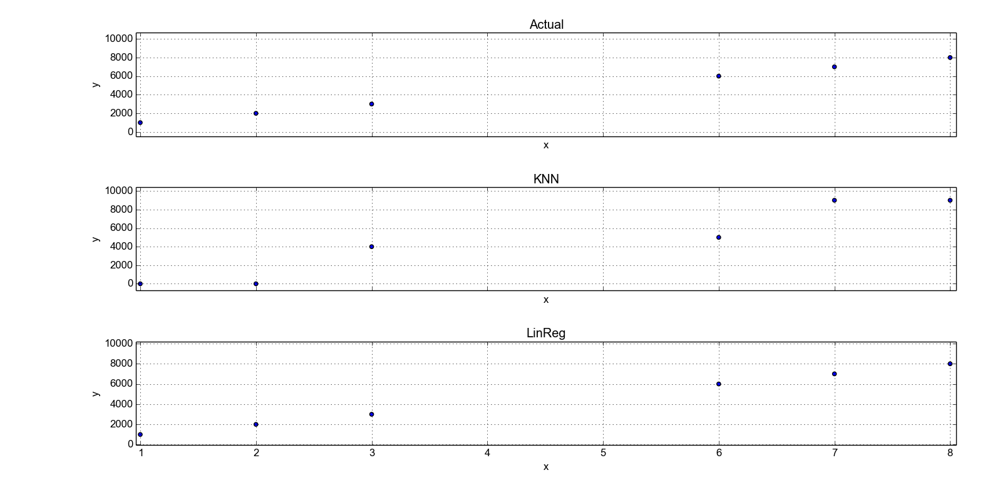

## Overview

We will evaluate the use of linear regression and KNN learning algorithms on various datasets. We will also explore the effect of various algorithm parameters on performance and overfitting.


## Custom Datasets

### Best for Linear Regression

Create your own dataset generating code (call it best4linreg.py) that creates data that performs significantly better with LinRegLearner than KNNLearner.


Explain your data generating algorithm, and explain why LinRegLearner performs better.
Your data should include at least 2 dimensions in X, and at least 1000 points. (Don't use bagging for this section).

The following is a simple algorithm for generating a dataset that performs better with linear regression:

```python
    for x in xrange(1000):
        point = ([x, x], 1000 * x)
```

The points follow a straight diagonal line with a high slope. The reason this works well with linear regression is that it exactly follows a linear model. The learner will find precise parameters for $$ y = mx + b $$, and  will able to interpolate any point along this line with high accuracy.

KNN, on the other hand, does not attempt to learn an underlaying model. It simply finds the average value of the closest training points. If the closest training points lay to one side of the test point, KNN will not be able to extrapolate from a model. Rather, it will return the average of the closer points.

Here is an example with 1d x:

    training points = [0, 1, 2]
    test points = [3, 4, 5]

In this case, KNN will return the average of k training points when queried with the test points. In every case, the estimate will be very far from the actual. In the case of k = 3 and using the data generating model of $$ y = 1000 * x $$, we get the following error:

    actual, estimate
    3000, 1000
    4000, 1000
    4000, 1000

On randomly distributed data, this limitation of KNN presents itself as under and over estimates of any points that need to be interpolated. As we see in Figure x, which shows a zoomed plot of testing data against both KNN and linear regression.



#### LinReg results

    In sample results
    RMSE:  2.79325142747
    corr:  0.999999999952

    Out of sample results
    RMSE:  2.97142933715
    corr:  0.999999999949


#### KNN results

    In sample results
    RMSE:  718.366173592
    corr:  0.999996702238

    Out of sample results
    RMSE:  1202.60984329
    corr:  0.99999203473


### Best for KNN

Create your own dataset generating code (call it best4KNN.py) that creates data that performs significantly better with KNNLearner than LinRegLearner.


Explain your data generating algorithm, and explain why KNNLearner performs better.
Your data should include at least 2 dimensions in X, and at least 1000 points. (Don't use bagging for this section).

#### KNN results

    In sample results
    RMSE:  7.19196543288
    corr:  0.992129724033

    Out of sample results
    RMSE:  11.0406799595
    corr:  0.981941492455


#### LinReg results

    In sample results
    RMSE:  55.9885148725
    corr:  0.212757185305

    Out of sample results
    RMSE:  57.5249782041
    corr:  0.177523761057


## KNN Evaluation

### Effect of K on Overfitting

Consider the dataset ripple with KNN. For which values of K does overfitting occur? (Don't use bagging).


### Effect of Bag Count on Performance

Now use bagging in conjunction with KNN with the ripple dataset.

How does performance vary as you increase the number of bags?


### Effect of Bag Count on Overfitting

Does overfitting occur with respect to the number of bags?


### Effect of Bagging with respect to K

Can bagging reduce or eliminate overfitting with respect to K for the ripple dataset?
