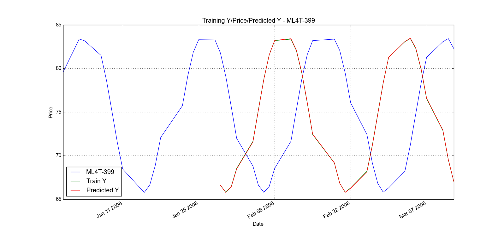
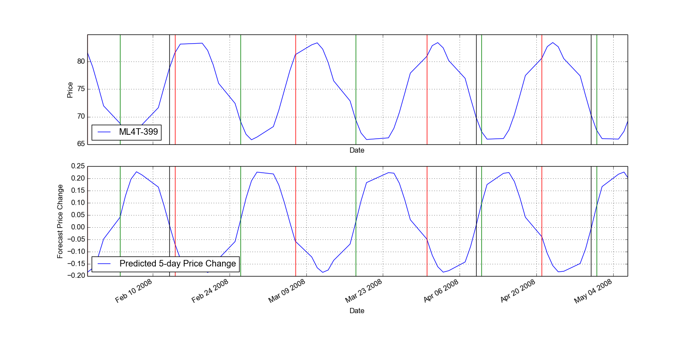
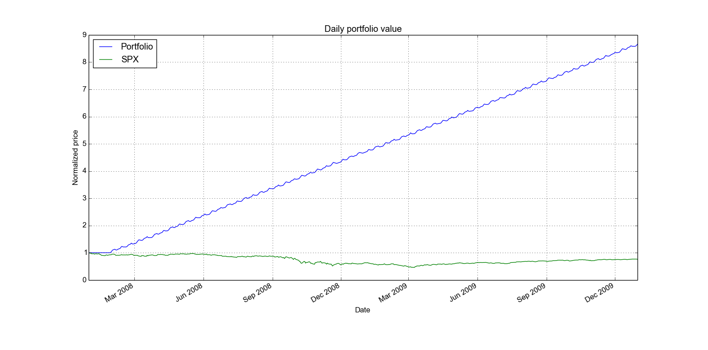
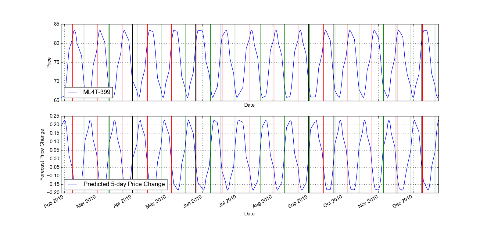
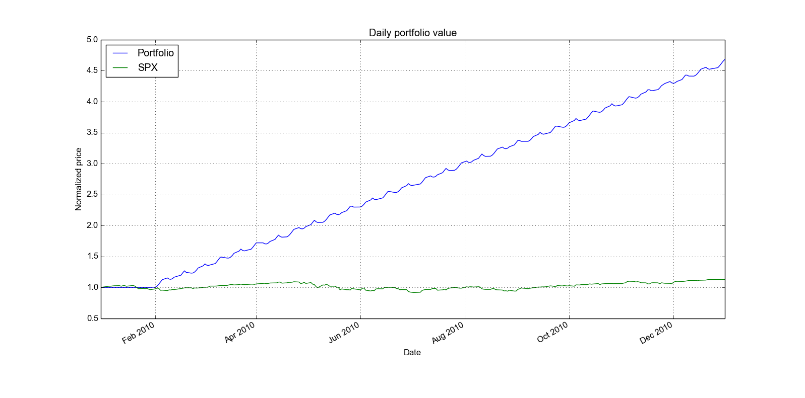
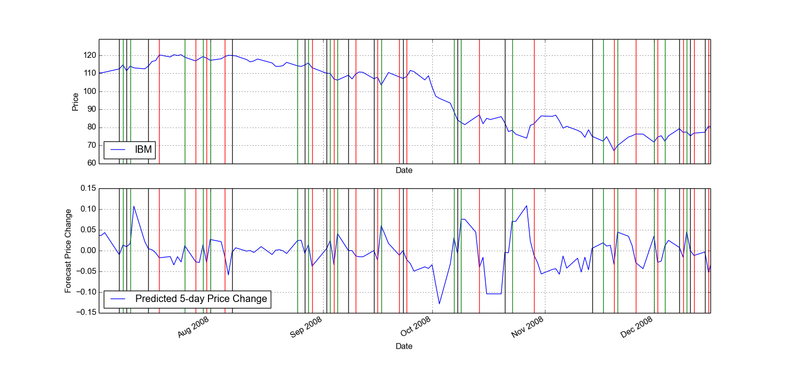
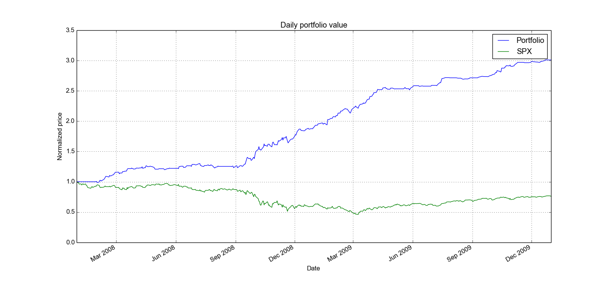
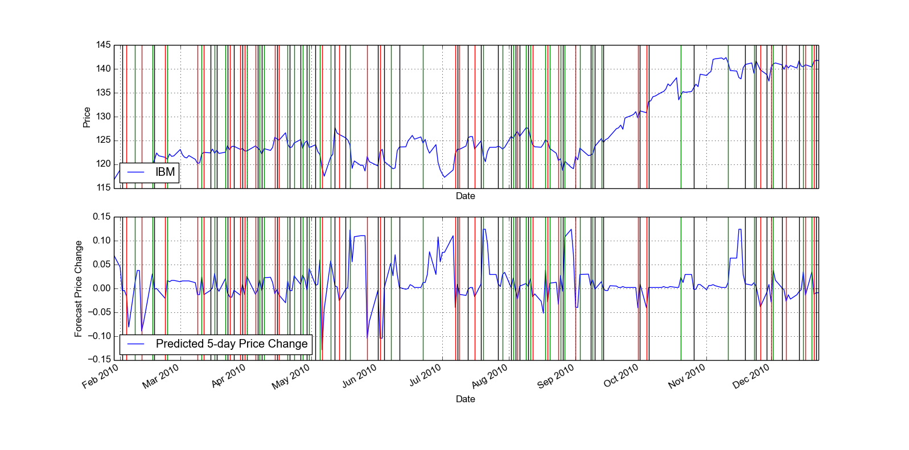
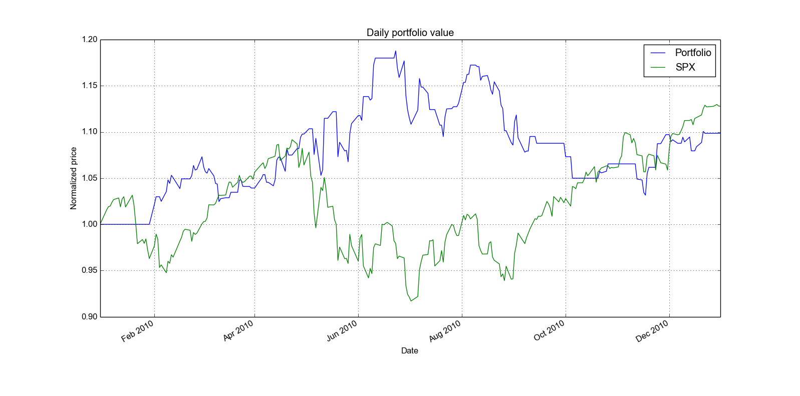

## Overview

We will evaluate the use of machine learning algorithms on creating trading strategies. Specifically, we will evaluate the use of KNN on forecasting future asset prices given a set of technical indicators.

### Regression Task

The following indicators were used as features in the regression task:

1. Bollinger Band Value w/ 20-day SMA/STDEV
2. 5 Day Price Momentum
3. 20 Day Rolling Standard Deviation

The regression task was set to predict the 5 day future asset price change. KNN was used with K=3 and euclidean distance as the metric.

### Trading Strategy

The predicted future price change was used to create a trading strategy that would enter a long position of 100 shares whenever the predicted change went over 1%, entered a short position of -100 shares when predicted change dropped below -1%, and exited any long/short positions when predicted change fell between 1% and -1%.

## ML4T-399 Dataset

### 2008-2009 Time Period

#### Regression Results

Figure 1 illustrates actual 5 day future price, predicted future price, and current price on the ML4T-399 dataset. We see that future prices, both actual and predicted, correctly lag 5 trading days behind current prices. We also see that predicted future prices and actual future prices visually match. This is validated by low cumulative error between predicted and actual Y values (RMSE: 0.0004, corr: 0.99).

#### Generated Trades

Figure 2 shows the entry and exits points period 2008-2009. Show long entries as green lines, short entries as red lines and exits as black lines. You may find it convenient to zoom in on a particular time period so this is evident.

#### Trading Strategy Backtest

    Data Range: 2007-12-31 to 2009-12-31

    Sharpe Ratio of Fund: 9.34910227904
    Sharpe Ratio of $SPX: -0.21996865409

    Cumulative Return of Fund: 7.65646479
    Cumulative Return of $SPX: -0.240581328829

    Standard Deviation of Fund: 0.00731742096044
    Standard Deviation of $SPX: 0.0219524869863

    Average Daily Return of Fund: 0.00430950789491
    Average Daily Return of $SPX: -0.000304189525556

    Final Portfolio Value: 86564.6479

Figure 3 shows the performance of our trading strategy

### 2010 Time Period

#### Generated Trades

Sine Data Out of Sample Entries/Exits: Freeze your model based on the 2008-2009 data. Now test it for the year 2010 -- Plot that illustrates entry & exits, generate trades,

#### Trading Strategy Backtest

Sine Data Out of Sample Backtest

    Data Range: 2009-12-31 to 2010-12-31

    Sharpe Ratio of Fund: 10.4088491304
    Sharpe Ratio of $SPX: 0.756512754402

    Cumulative Return of Fund: 3.67897198
    Cumulative Return of $SPX: 0.127827100708

    Standard Deviation of Fund: 0.00943439017466
    Standard Deviation of $SPX: 0.0113715303326

    Average Daily Return of Fund: 0.00618609060464
    Average Daily Return of $SPX: 0.000541919649169

    Final Portfolio Value: 46789.7198

Learning results

    In sample results
    RMSE:  0.00182176340524
    corr:  0.999922732335

## ML4T-399 Dataset

### 2008-2009 Time Period

#### Regression Results

#### Generated Trades

IBM Data In Sample Entries/Exits: Create a plot that illustrates entry and exits as vertical lines on a price chart for the in sample period 2008-2009. Show long entries as green lines, short entries as red lines and exits as black lines. You may find it convenient to zoom in on a particular time period so this is evident.

    In sample results
    RMSE:  0.0310958524397
    corr:  0.697132609597

#### Trading Strategy Backtest

IBM Data In Sample Backtest

    Data Range: 2007-12-31 to 2009-12-31

    Sharpe Ratio of Fund: 3.70915105837
    Sharpe Ratio of $SPX: -0.21996865409

    Cumulative Return of Fund: 2.0096
    Cumulative Return of $SPX: -0.240581328829

    Standard Deviation of Fund: 0.00954080200275
    Standard Deviation of $SPX: 0.0219524869863

    Average Daily Return of Fund: 0.00222925183849
    Average Daily Return of $SPX: -0.000304189525556

    Final Portfolio Value: 30096.0

### 2010 Time Period

#### Generated Trades

IBM Data Out of Sample Entries/Exits: Freeze your model based on the 2008-2009 data. Now test it for the year 2010 -- Plot that illustrates entry & exits, generate trades,

#### Trading Strategy Backtest

IBM Data Out of Sample Backtest

    Data Range: 2009-12-31 to 2010-12-31

    Sharpe Ratio of Fund: 0.679632745049
    Sharpe Ratio of $SPX: 0.756512754402

    Cumulative Return of Fund: 0.0985
    Cumulative Return of $SPX: 0.127827100708

    Standard Deviation of Fund: 0.00983141011967
    Standard Deviation of $SPX: 0.0113715303326

    Average Daily Return of Fund: 0.000420910575847
    Average Daily Return of $SPX: 0.000541919649169

    Final Portfolio Value: 10985.0

Learning results

    In sample results
    RMSE:  0.04283663904
    corr:  0.140995673532

